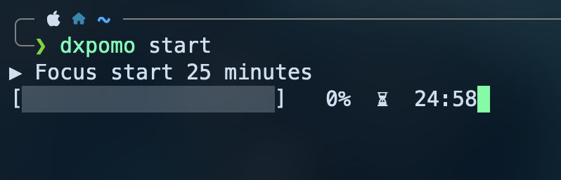
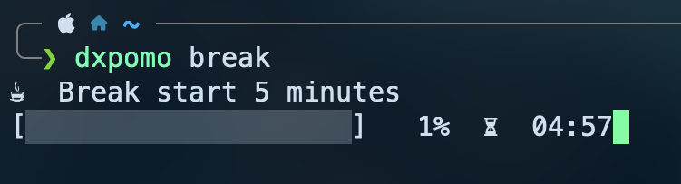
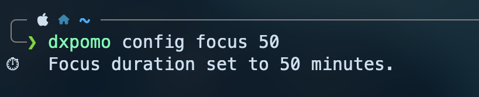
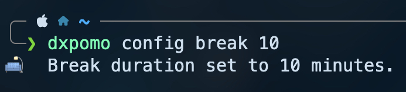
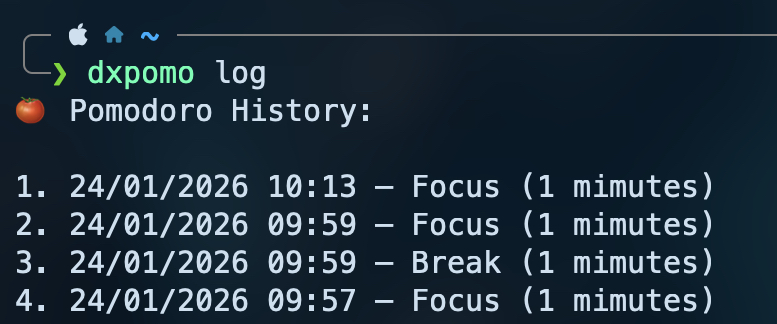
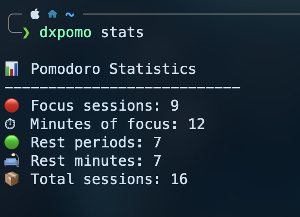
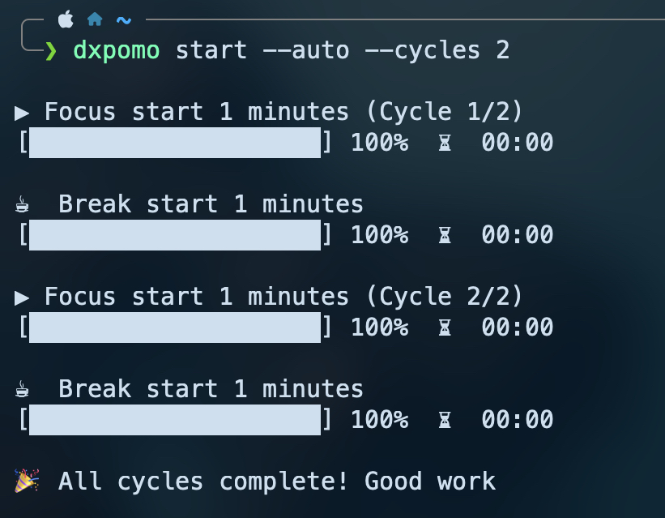

# 🍅 dxPomo CLI

**dxPomo** is a command-line interface (CLI) application written in **Rust** for focus and productivity management using the **Pomodoro technique**.

It is designed to be **simple**, making it ideal for daily use directly from the terminal.  
All data is persisted locally.

This project was built with the goal of **studying and practicing Rust**, while delivering a real, usable tool.

---

## ✨ Features

- Focus and break timers (Pomodoro-style)
- Configurable focus and break durations
- Automatic multi-cycle execution
- Cancel running timers with `Ctrl + C`
- Visual countdown and progress bar
- Local persistence of logs and statistics
- Homebrew support for easy installation on macOS

---

## 📦 Installation (macOS)

Using **Homebrew**:

```bash
brew tap jdurvalino/dxpomo
brew install dxpomo
```


---

## Usage

### Start a focus session
```bash
dxpomo start
```
 


### Start a break
```bash
dxpomoo break
```

 

### Configure duration

set a focus duration:
``` bash
dxpomo config focus n  
```

 

Set a break duration:
```bash
dxpomo config break n
``` 

 


### View current configuration
``` bash
dxpomo config show
``` 

 

> [!TIP]
> The config are stored in a file called config.json, located in the .dxpomo in your Home directory.
> ~/.dxPomo/log.json 


### View history
``` bash 
dxpomo log
``` 

 

> [!TIP]
> The logs are stored in a file called log.json, located in the .dxpomo in your Home directory.
> ~/.dxPomo/log.json 


### View statistics
```bash 
dxpomo stats
```

 

### Cycles
``` bash 
dxpomo start --auto --cycles n
```

 


## 🛠️ Built With

- [Rust](https://www.rust-lang.org/)
- [`clap`](https://crates.io/crates/clap) — CLI argument parsing
- [`serde`](https://crates.io/crates/serde) — serialization and deserialization
- [`chrono`](https://crates.io/crates/chrono) — date and time handling


## 📄 License

This project is open-source and available under the **MIT License**.  
See the [LICENSE](./LICENSE) file for more details.

